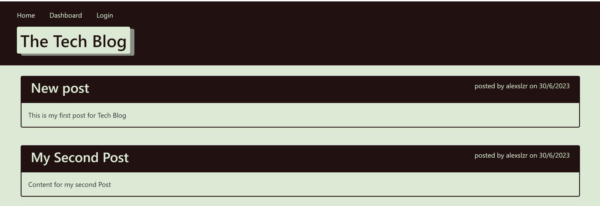
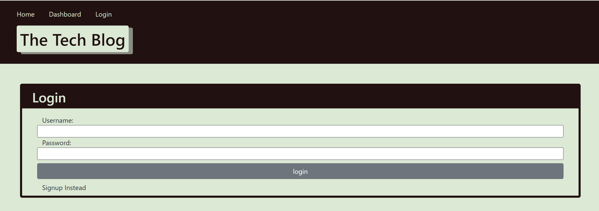

# Tech Blog

</img>

## Description

Writing about tech can be just as important as making it. Developers spend plenty of time creating new applications and debugging existing codebases, but most developers also spend at least some of their time reading and writing about technical concepts, recent advancements, and new technologies. A simple Google search for any concept covered in this course returns thousands of think pieces and tutorials from developers of all skill levels!

This Aplication is a CMS-style blog site similar to a Wordpress site, where developers can publish their blog posts and comment on other developers’ posts as well. using the MVC paradigm in its architectural structure, using Handlebars.js as the templating language, Sequelize as the ORM, and the express-session npm package for authentication.

## User Story

```md
AS A developer who writes about tech
I WANT a CMS-style blog site
SO THAT I can publish articles, blog posts, and my thoughts and opinions
```

## Mock-Up

The following Image demonstrates actual look of the application:
 

Login:
 

## License

This project utilizes an MIT License. [Read more](https://choosealicense.com/licenses/mit/)


## Links

Github: <br> https://github.com/Alexslzr

App: <br> https://pacific-bayou-28721-544ed386ada5.herokuapp.com/

Repo: <br> https://github.com/Alexslzr/Tech-Blog

